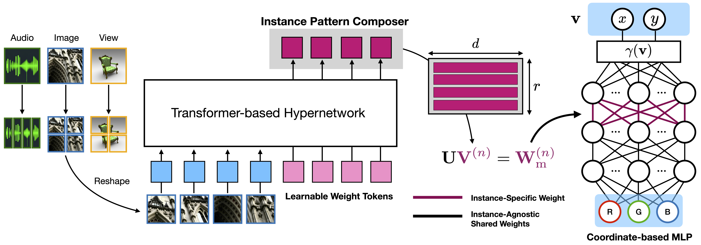

# Generalizable Implicit Neural Representations with Instance Pattern Composers (CVPR'23 Highlight)

The official implementation of "[Generalizable Implicit Neural Representations with Instance Pattern Composers](https://arxiv.org/abs/2211.13223)"   
Chiheon Kim*, Doyup Lee*, Saehoon Kim, Minsu Cho, Wook-Shin Han (*Equal contribution).   
**CVPR'23 Highlight**

<center></center>

**TL;DR** We propose generalizable implicit neural representations (INRs) for a coordinate-based MLP to learn common representations across data instances, while modulating only a small set of weights in an early MLP layer as instance-specific patterns to characterize each data instance.


## Requirements
We have tested our codes on the environment below  
- `Python 3.7.13` / `Pytorch 1.13.0` / `torchvision 0.13.1` / `CUDA 11.3` / `Ubuntu 18.04`  .  

Please run the following command to install the necessary dependencies
```bash
pip install -r requirements.txt
```

## Coverage of Released Codes
This repository includes the implementations of 
- a coordinate-based MLP to be modulated by our instance pattern composers.   
- transformer-based hypernetworks to predict instance pattern composers.  
- optimization-based meta-learning for our generalizable INRs.  
- baseline models of transformer-based hypernetwork (TransINR) and meta-learning (Learned Init).
- training and evaluation codes.   

## Preparation of Datsets  
Before running the training and evaluation codes, the datasets have to be prepared. Please refer to the details in `data/README.md`.  


## Training and Evaluation

### Training
Our implementation uses `DistributedDataParallel` in `Pytorch` for efficient training with multi-node and multi-GPU environments. We commonly use **Four NVIDIA V100 GPUs** to train our generalizable INRs, but you can also adjust the command-line arguments `-nr`, `-np`, and `-nr` according to GPU environments.  

All config files are located in the subdirectory of `configs/`, including the proposed models (`low_rank_modulated_transinr` and `low_rank_modulated_meta`) and the compared baselines (`transinr`, `learned_init`).  

To train a model under the environment with a single node having four GPUs, use the script below to run training codes. For training on other tasks or datasets, simply change the config file information `$CONFIG_FILE`. During training, checkpoints and logs are saved in `$SAVE_DIR`. 
```bash
./run_stage_inr.sh -nn=1 -np=4 -nr=0 -r=$SAVE_DIR -m=$CONFIG_FILE
```


### Evaluation
After the training, evaluation codes are automatically executed and the checkpoints are saved. If you want to manually evaluate a checkpoint, run the code below
```bash
./run_stage_inr.sh -nn=1 -np=1 -nr=0 -r=$SAVE_DIR -l=$CHECKPOINT_FILE --eval
```

**NOTE**
- The model checkpoint and its configuration YAML file have to be located in the same directory.
- Adjust `--batch-size` as the memory size of your GPU environment.

## BibTex
```
@article{kim2022generalizable,
  title={Generalizable Implicit Neural Representations via Instance Pattern Composers},
  author={Kim, Chiheon and Lee, Doyup and Kim, Saehoon and Cho, Minsu and Han, Wook-Shin},
  journal={arXiv preprint arXiv:2211.13223},
  year={2022}
}
```

## Contact
If you would like to collaborate with us or provide us with feedback, please contact us.  

## Acknowledgement
We appreciate the authors of [TransINR](https://github.com/yinboc/trans-inr) for making their codes available to the public. We develop our codes based on and modify the implementation of TransINR.  
